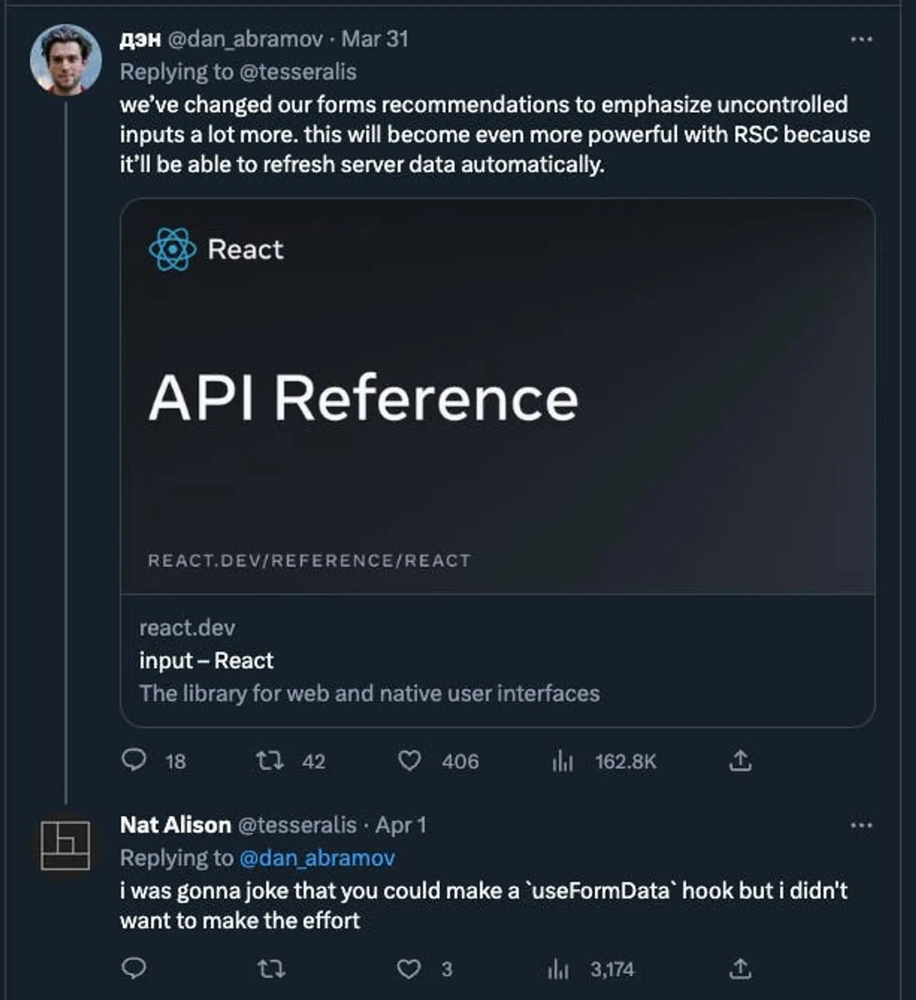
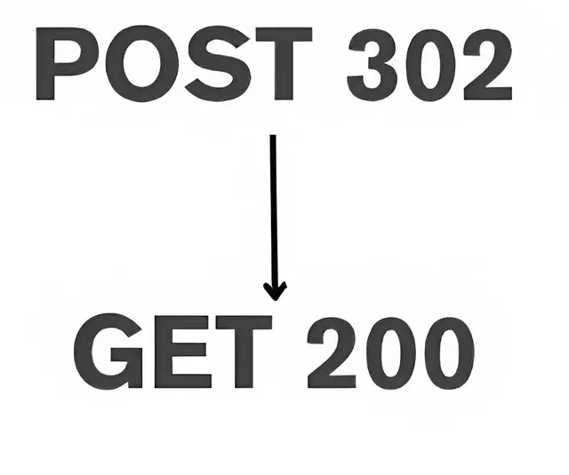
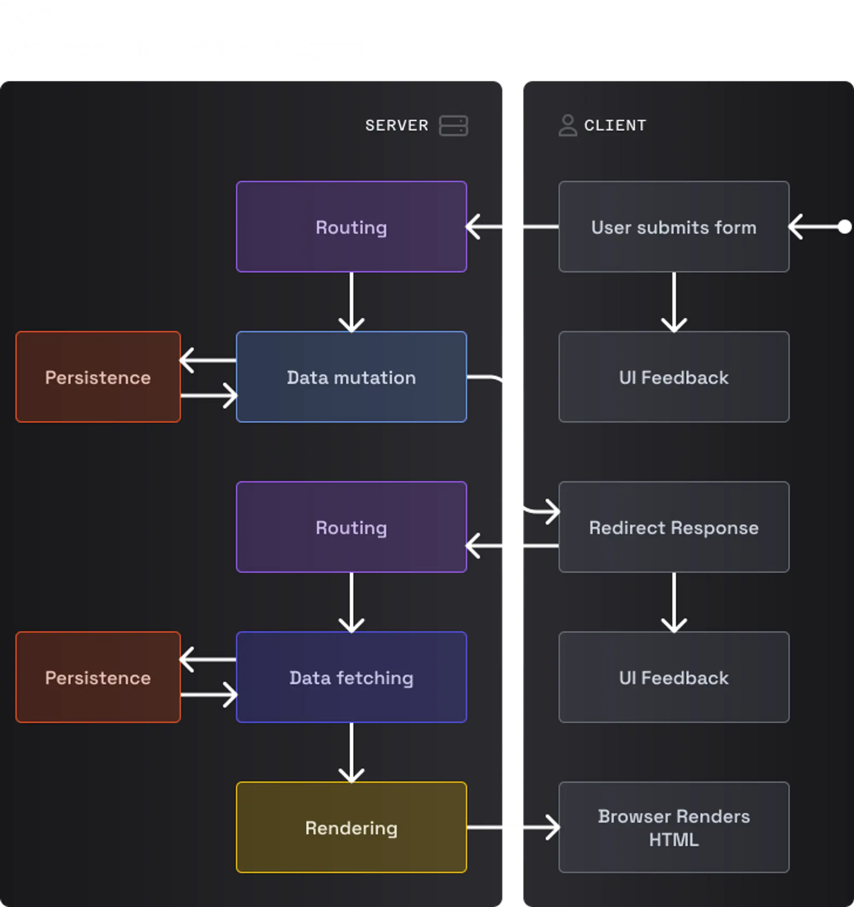
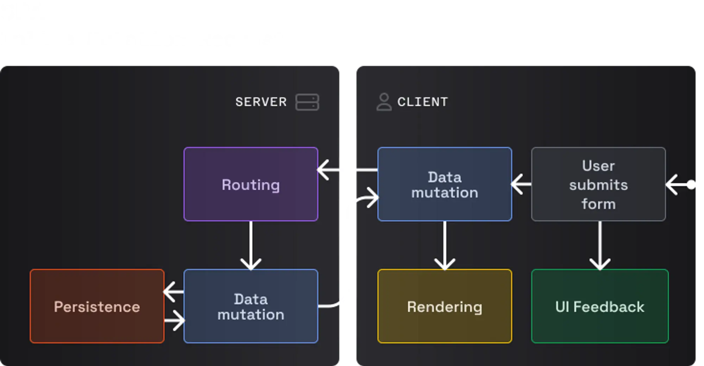
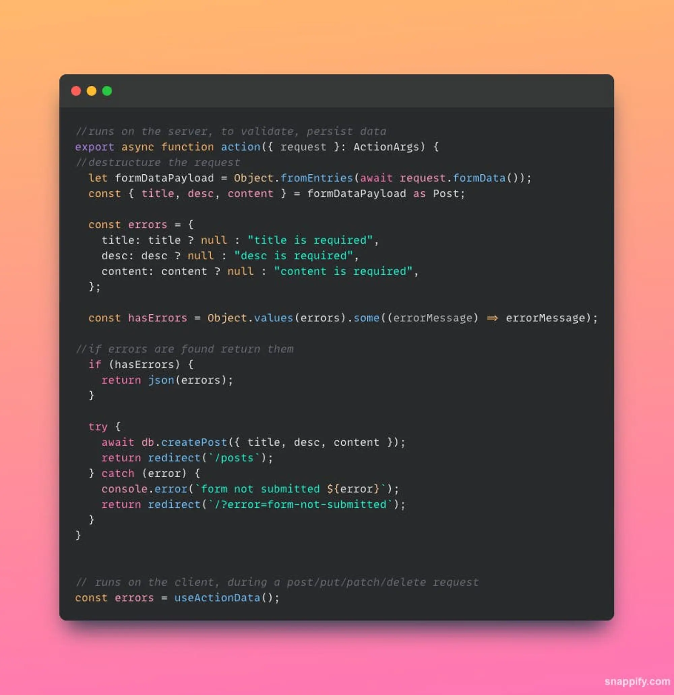
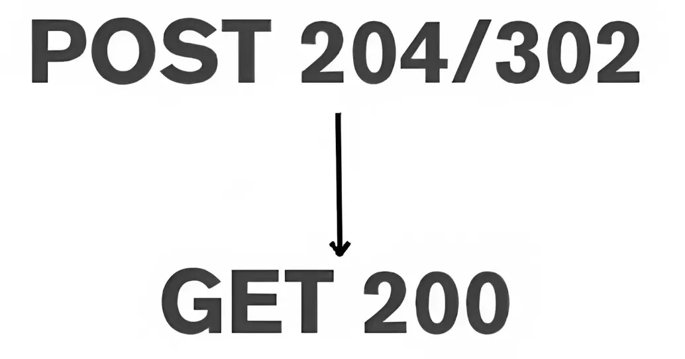
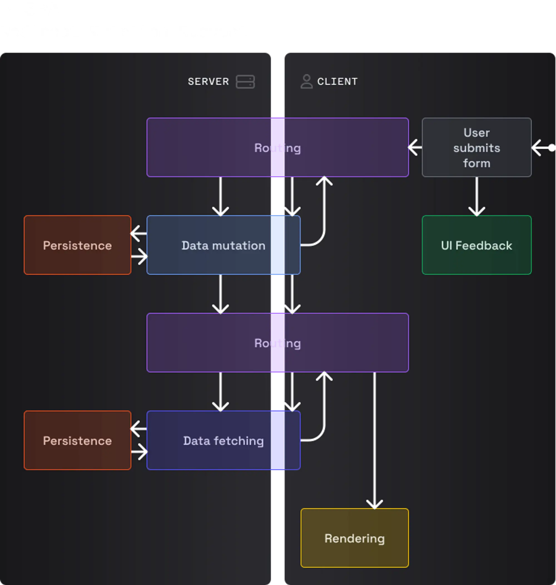

## **Introduction**

Recently I gave a talk on how things are changing around the web ecosystem, especially with React. I also explored how we can adopt better practices with writing forms.

Personally, I have been using Remix in one of the open-source products I have been working on with some talented folks at RealDevSquad. I have been loving the Remix approach with forms and what they have brought in with the [**loaders**](https://remix.run/docs/en/main/route/loader) and [**actions**](https://remix.run/docs/en/1.15.0/components/form#action)**.** It is very intuitive to the way that web was around the time of MPAs (Multi-page apps).

But why did I choose to explore this further?



I was browsing Twitter, and I saw this tweet by Dan Abramov. I was working on a Remix app that also recommends uncontrolled forms. It was a topic worth exploring. So I started my voyage to see what is the issue at hand, which approach is better, and why it is better.

## **TLDR**

### What is Remix?

[Remix](https://remix.run/), which is also a React framework, was co-founded by ex-Twitter engineer **Michael Jackson along with Ryan Florence** in 2020. Before this, the two had been working together for years to create open-source tools based on the [JavaScript](https://analyticsindiamag.com/the-javascript-framework-that-solves-the-annoying-feature-speed-paradox/) library React that is used to build app UIs.They are also core members of the react-router team.

### Some Technical Terms

1. MPA

   **A Multi-Page Application (MPA)** is a website consisting of multiple HTML pages, mostly rendered on a server. When you navigate to a new page, your browser requests a new page of HTML from the server.

2. SPA

   **A Single-Page Application (SPA)** is a website consisting of a single JavaScript application that loads in the user's browser and then renders HTML locally. SPAs may _also_ generate HTML on the server, but SPAs are unique in their ability to run your website as a JavaScript application in the browser to render a new page of HTML when you navigate. [Next.js](https://geekyants.com/hire-next-js-developers/), Nuxt.js, SvelteKit, Remix, Gatsby, and Create React App are all examples of SPA frameworks.

3. PESPA

   A **PESPA (Progressively enhanced Single Page App)** is a term coined by **_Kent C. Dodds_** in one of his blogs called [the webs next transition](https://www.epicweb.dev/the-webs-next-transition), where he describes a PESPA as a mix of both SPA and the MPA world which brings the best of both worlds to improve UX and DX.

   ### We have divided this blog into three parts in the same way:

   1. _MPA_
   2. _SPA_
   3. _PESPA_

## **What are We Going to Cover in This Blog?**

Forms have existed from the time the web has existed. Over this period, we have come to write forms in multiple ways. There were a lot of things about forms that evolved with time as well, in terms of both DX (developer experience) and [UX (user experience)](https://geekyants.com/ui-ux-design-services/). For users, it was validations of the fields, clicking on focus etc. For developers, it was how easy it is to write cumbersome validations and where they should be maintaining state etc. This blog covers how we evolved w.r.t to writing and viewing forms and how Remix might be changing the way we write forms going forward.

## **What are Forms?**

> **_Forms are a navigation event -_** [**_Ryan Florence_**](https://reactresources.com/people/ryan-florence)

If you take a closer look at forms, they are similar to anchor tags. The only difference between the form and the anchor tag is that with the form, we can send some data to the server, whereas an anchor tag just does redirection/navigation for us.

## **How Did Forms Work in the Past?**

If you see at the inception of the web when everything just happened on the server and we used to get pre-rendered HTML from the server, a form would look something like this.

```html
<form action="http://localhost:4130/posts" method="POST">
  <div class="flex flex-col">
    <input type="hidden" name="intent" value="createPost" />
    <label for="input-1"><h3>title</h3></label>
    <input
      type="text"
      id="input-1"
      name="title"
      placeholder="title"
      class="w-100"
    />
    <label for="input-2"><h3>description</h3></label>
    <input type="text" id="input-2" name="description" class="w-100" />
    <label for="input-3"><h3>content</h3></label>
    <textarea
      name="content"
      id="input-3"
      cols="30"
      rows="10"
      name="content"
    ></textarea>
  </div>
  <div class="flex justify-end">
    <input type="submit" value="Submit" />
  </div>
</form>
```

This is a very simple implementation of a form, no JavaScript. I could just link this HTML page with some CSS if I want to correspond to the class names, but that is it, I would not require much configuration. Once I make the `POST` request, I can expect the server to get the data from the database and return the data with a redirect response to the client. We can expect the responses to be in this order:

- `POST` request triggers a redirect response from the server.
- `redirect` causes the client to refresh and get the data from the server.





[**Source (article by Kent C.Dodds)**](https://www.epicweb.dev/the-webs-next-transition)

You can refer to the code [**here**](https://github.com/isVivek99/forms-framework-Debate/tree/master/01-mpa).

### **Pros of the Approach**

1. We have a simple mental model.
2. We do not need to lot of code to write a simple form.
3. We can add built-in HTML validations.
4. We can expect the browser the create and send the payload over the wire to the server when we click on submit.

### **Cons of the Approach**

1. We cannot have custom error validations.
2. Full page refresh is triggered on every post request.
3. We cannot have an optimistic UI, although we can show pending UI with CSS, but we can face some limitations.

## **How Did Forms Look During the SPA Era?**

We could have a debate based on the fact alone that we are past the SPA phase. I think that this would need context, and I think we are in a transition phase with different frameworks around. But I assume there is a common consensus that there was a period when we used SPAs heavily, so considering that, we are going to look at React and how we handle forms in React.

With React, we can get the state, which we can use for controlling input fields, we can easily show optimistic UI or a pending UI and we can also prevent whole page re-renders because we can use JavaScript to append data to the state.

A form in React would look like this.

```typescript
import React from "react";
import { useForm, Resolver } from "react-hook-form";
import "./blog.css";

type Post = { id: string; title: string; desc: string; content: string };

type FormValues = {
  title: string;
  desc: string;
  content: string;
};

const resolver: Resolver<FormValues> = async (values) => {

  return {
    values: values.title ? values : {},
    errors: !values.title
      ? {
          title: {
            type: "required",
            message: "This is required.",
          },
        }
      : !values.desc
      ? {
          desc: {
            type: "required",
            message: "This is required.",
          },
        }
      : !values.content
      ? {
          content: {
            type: "required",
            message: "This is required.",
          },
        }
      : {},
  };
};
let renderCount = 0;
const Posts = () => {
  const [posts, setPosts] = React.useState<Array<Post>>([]);
  const [statuses, setStatuses] = React.useState<{
    loadingPosts: "idle" | "loading";
    creatingPost: "idle" | "loading";
  }>({
    loadingPosts: "loading",
    creatingPost: "idle",
  });
  const {
    register,
    handleSubmit,
    formState: { errors },
  } = useForm({ resolver });

  renderCount++;

  // initial load of posts
  React.useEffect(() => {
    fetch("http://localhost:4131/api/posts")
      .then((res) => res.json())
      .then(({ posts }) => {
        setPosts(posts);
        setStatuses((old) => ({ ...old, loadingTodos: "idle" }));
      });
  }, []);

  return (
    <div className=' m-auto'>
      renderCount:{renderCount}
      <div className='flex'>
        <div className='flex-basis-1-3'>
          <ul hidden={!posts.length}>
            {posts.map((post, i) => (
              <li key={i}>
                <p className='bold my-1'>{post.title}</p>
                <p className='bold my-1'>{post.desc}</p>
              </li>
            ))}
          </ul>
        </div>
        <div className='border-r-2 px-2 mx-2'></div>

        <div className='flex-basis-2-3'>
          <div className='border-b-2 border-color-brown'>
            <h1>My Blog</h1>
          </div>
          <form
            onSubmit={handleSubmit((data, e) => {
              const { title, desc, content } = data;
              e?.target.reset();

              setPosts([
                ...posts,
                { title, desc, content, id: Math.random().toFixed(2) },
              ]);

              setStatuses((old) => ({ ...old, creatingPost: "loading" }));
              fetch(`http://localhost:4131/api/posts`, {
                method: "POST",
                headers: { "Content-Type": "application/json" },
                body: JSON.stringify({ title, desc, content }),
              })
                .then((res) => res.json())
                .then((data) => {
                  setPosts((prev) => {
                    prev[prev.length - 1] = data.post;
                    console.log(posts);
                    return prev;
                  });

                  setStatuses((old) => ({ ...old, creatingPost: "idle" }));
                });
            })}
          >
            <div className='flex flex-col'>
              <label htmlFor='input-1'>
                <h3>title</h3>
              </label>
              <input
                id='input-1'
                className={`w-100 ${
                  errors.title?.message ? "input-error" : ""
                }`}
                data-pending={statuses.creatingPost === "loading"}
                {...register("title", { required: "this field is required." })}
              />

              <p className='error'>{errors.title?.message}</p>
              <label htmlFor='input-2'>
                <h3>desc</h3>
              </label>
              <input
                id='input-2'
                className={`w-100 ${errors.desc?.message ? "input-error" : ""}`}
                data-pending={statuses.creatingPost === "loading"}
                {...register("desc", {
                  required: "this field is required.",
                })}
              />
              <p className='error'>{errors.desc?.message}</p>
              <label htmlFor='input-3'>
                <h3>content</h3>
              </label>
              <textarea
                id='input-3'
                cols={30}
                rows={10}
                className={`w-100 ${
                  errors.content?.message ? "input-error" : ""
                }`}
                {...register("content", {
                  required: "this filed is also required.",
                })}
                data-pending={statuses.creatingPost === "loading"}
              ></textarea>
              <p className='error'>{errors.content?.message}</p>
            </div>
            <div className='flex justify-end'>
              <button
                type='submit'
                disabled={statuses.creatingPost === "loading"}
              >
                create post
              </button>
            </div>
          </form>
        </div>
      </div>
    </div>
  );
};
```

You can notice that I am not using any controlled input field. Instead, I am using a library called `react-hook-form`**,** which uses refs instead of state, which means we are considerably reducing the re-renders that we would have gotten with using controlled forms.

We can expect the responses to be in this order:

- `POST` request triggers a status `OK`, the response from the server.
- the received response can be added to the posts list on success. Else we can show an error alert.


This is how the form would work in the case of our SPA.



You can refer to the code [**here**](../../../src/assets/blogs/remix-better-forms-for-better-ux-and-dx/img-6.webp)**.**

### **Pros of the Approach**

1. We can add optimistic UI.
2. We can add pending UI.
3. We can add built-in HTML validations.

### **Cons of the Approach**

1. We don't have a simple mental model.
2. We have to create a request, prevent the default behavior of the browser and send data to a URL by creating the payload, which the browser can also do, but we hijack it and make it more difficult.
3. We have to write a lot of code for the form to work (130 lines here).

## **A Better Way to Write Forms?**

Till now, we have seen two different ways of writing forms, and both have their pros and cons. But what if I tell you that we can use the pros which we have seen at both places, plus add type safety and server-side validations in case your javascript has not loaded yet on the client? Would you believe me?

Well, that is where Remix mental modal for forms comes into the picture.

With Remix, you have a function that runs on the server for different HTTP calls.



This is a `loader` function, which runs on the server for every `GET` call.



This is an `action` function which runs on the server when we make a `POST/ PUT/ DELETE` call to the server.

This is how the form would look like.

```typescript
export default function Posts() {
  // get data when the loader function runs on the mount of the                 component
  const data = useLoaderData() as { posts: Array<Post> };

  // returns errors from the action function when user submits the form
  const errors = useActionData();
//hook exposed by remix/react to track states of the form i.e. submitting/loading/idle
  const transition = useTransition();

  const text =
    transition.state === "submitting"
      ? "Saving..."
      : transition.state === "loading"
      ? "Saved!"
      : "create post";

  return (
    <div className=" m-auto">
      <div className="flex">
        <div className="flex-basis-1-3">
          <ul hidden={!data.posts.length}>
            {data.posts.map((post, i) => (
              <li style={{ marginBottom: "20px" }} key={i}>
                <p className="bold my-1">{post.title}</p>
                <p className="bold my-1">{post.desc}</p>
              </li>
            ))}
          </ul>
        </div>
        <div className="mx-2 border-r-2 px-2"></div>

        <div className="flex-basis-2-3">
          <div className="border-color-brown border-b-2">
            <h1>My Blog</h1>
          </div>
          <Form
            method="post"
            onSubmit={(event) => {
              const form = event.currentTarget;
              requestAnimationFrame(() => {
                form.reset();
              });
            }}
          >
            <div className="flex flex-col">
              <label htmlFor="input-1">
                <h3>title</h3>
              </label>
              <input
                type="text"
                id="input-1"
                className="w-100"
                autoFocus
                data-pending={
                  transition.state === "submitting" ||
                  transition.state === "loading"
                }
                name="title"
              />
              {errors?.title && <p className="error">{errors.title}</p>}
              <label htmlFor="input-2">
                <h3>desc</h3>
              </label>
              <input
                type="text"
                id="input-2"
                className="w-100"
                name="desc"
                data-pending={
                  transition.state === "submitting" ||
                  transition.state === "loading"
                }
              />
              {errors?.desc && <p className="error">{errors.desc}</p>}
              <label htmlFor="input-3">
                <h3>content</h3>
              </label>
              <textarea
                id="input-3"
                cols={30}
                rows={10}
                name="content"
                data-pending={
                  transition.state === "submitting" ||
                  transition.state === "loading"
                }
              ></textarea>
              {errors?.content && <p className="error">{errors.content}</p>}
            </div>
            <div className="flex justify-end">
              <button
                type="submit"
                disabled={
                  transition.state === "submitting" ||
                  transition.state === "loading"
                }
              >
                {text}
              </button>
            </div>
          </Form>
        </div>
      </div>
    </div>
  );
}
```

This is how you would work with the form:

- You get the data from the server when the page loads using the `useLoaderData` hook.
- You write JSX for your form, and you can use the state from the `useTransition` hook for adding optimistic /pending UI.
- Whenever the user fills out the form and clicks on submit, the request is sent to the `action` function, which runs on the server and can validate the data using native JavasScript APIs.
- If the request is successful, you can return a redirect response from the server, which will trigger the `useLoaderData` hook instead of a full page refresh, and you will get the latest posts from the server, which will be displayed on the screen.

### **Response Sequence**

This is the way you can expect the order of responses to be when you submit the form.

- A successful post request triggers a `redirect` response from the server.
- The redirect response triggers a `get` call on the client.



This is how the form would work in the case of what Kent C. Dodds calls a PESPA (progressively enhanced single-page app).


You can refer to the code [**here**](https://github.com/isVivek99/forms-framework-Debate/tree/master/03-pespa/blog-tutorial/app/routes)**.**

### **Pros of this Approach**

1. We have a SPA with a mental model of an MPA, i.e. old web and new web combined.
2. We can add optimistic UI.
3. We can add pending UI.
4. We can add custom validations on the server as well as on the client by using `react-hook-form`.
5. We can see the form is smaller compared to the old react form (100 lines).

### **Cons of this Approach**

1. I personally think that there is a drastic change in the mental model and it will be difficult to get accustomed to.

## **Conclusion**

I think that with RSC(React Server Components) coming in, we are already moving more toward the server. The React team feels that for new devs coming in, the server is the best place to start instead of the client. And I am up for it.
